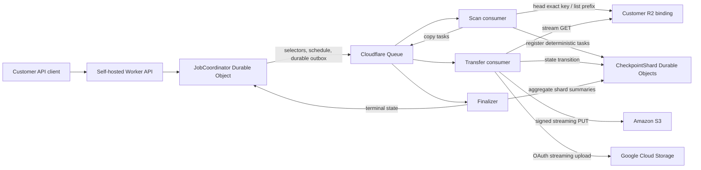

# Architecture and storage decision

## Decision

Use SQLite-backed Durable Objects as the system of record. Hash every object
key deterministically into a fixed number of per-job checkpoint shards. Use
Cloudflare Queues to deliver work at least once. Do not use Workers KV for
mutable checkpoints or authoritative counters.



## Durable Objects versus KV

| Concern | SQLite-backed Durable Objects | Workers KV |
| --- | --- | --- |
| Consistency | Strongly consistent, transactional storage per object | Eventually consistent; remote locations may lag by 60 seconds or more |
| Hot-key writes | One object has a 1,000 requests/second soft limit | One write/second to the same key |
| Horizontal scale | Unlimited object instances; deterministic names route consistently | Different keys scale, but aggregate counters become conflicting hot keys |
| Storage | 10 GB per object; paid account/class storage is unlimited | 25 MiB values; paid account/namespace storage is unlimited |
| Best fit | State machines, idempotency, counters, checkpoints, schedules | Read-heavy config, cache, or disposable snapshots |

Sources: [Durable Objects limits](https://developers.cloudflare.com/durable-objects/platform/limits/),
[Durable Objects storage](https://developers.cloudflare.com/durable-objects/best-practices/access-durable-objects-storage/),
[KV limits](https://developers.cloudflare.com/kv/platform/limits/), and
[KV consistency](https://developers.cloudflare.com/kv/api/write-key-value-pairs/).

## Deterministic sharding

```text
task_id = SHA-256(job_id, object_key, object_version, destination)
shard   = uint32(SHA-256(job_id, object_key)[0:4]) mod shard_count
DO name = job_id + ":" + hex(shard)
```

Shard count is fixed when a job is created. At the Queue limit of 5,000
messages/second, 64 uniformly distributed shards average roughly 78 requests
per second each. This leaves headroom below the 1,000 requests/second soft limit
for one Durable Object even when each copy performs several state transitions.

## Queue and Worker limits

Queues currently supports 5,000 messages/second per queue, 25 GB of backlog,
128 KB messages, 100-message batches constrained to 256 KB per `sendBatch`, and
250 concurrent push consumers. Delivery is at least once. See
[Queues limits](https://developers.cloudflare.com/queues/platform/limits/) and
[delivery guarantees](https://developers.cloudflare.com/queues/reference/delivery-guarantees/).

The consumer batch size is one. Each transfer holds an R2 response stream and an
external upload, while Workers allows six simultaneous outgoing connections and
128 MB of memory. Queue concurrency provides horizontal parallelism without
building multiple large streams in one isolate. A queue consumer has a
15-minute wall-clock limit. See
[Workers limits](https://developers.cloudflare.com/workers/platform/limits/).

Scanner checkpoint registration and status aggregation both issue Durable
Object RPCs in groups of six. Destination existence responses that are not read
are explicitly canceled. The seventh connection would otherwise be queued by
the runtime until an earlier request receives response headers.

Approximate object throughput is:

```text
min(5,000 messages/s, 250 consumers / average transfer seconds)
```

For example, two-second transfers yield roughly 125 objects/second per queue.
Multiple queues can partition tenants or destination regions when the
per-queue consumer ceiling becomes the bottleneck.

R2 objects can be as large as 5 TiB. The current 512 MiB single-upload guard is
deliberately conservative until resumable/multipart checkpoints are added. See
[R2 limits](https://developers.cloudflare.com/r2/platform/limits/).
