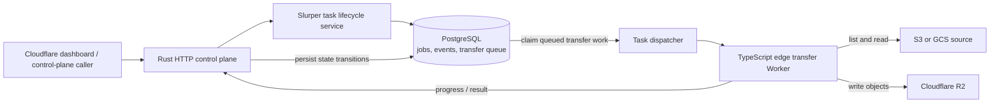

# Super Slurper reference architecture

This is the high-level architecture inferred from the archived
`cloudflare/r2/super-slurper` GitLab repository. It records the system being
reversed, not a dependency of Super Spouter.

The split is a durable Rust control plane plus PostgreSQL-backed lifecycle and
queue state, with object bytes moved by a TypeScript Worker near the edge. SQL
coordinates concurrent task claiming; lifecycle events advance a migration
through discovery and transfer states. This is why the reverse-flow design can
reuse the useful separation between orchestration and streaming while replacing
the private control plane and PostgreSQL with customer-owned Cloudflare
Developer Platform primitives.

## Worker connection model

Super Slurper kept high concurrency outside each Cloudflare Worker invocation.
The edge Worker accepted one `POST /v1/transfer`, then streamed one source object
or multipart range into one R2 `putObject`/`uploadPart`. The Rust workers split
batches into individual edge requests and controlled their concurrency; the
production configuration used ten files per task, 100 MB multipart parts, and
64 concurrent Rust tasks per worker process. Consequently, one edge invocation
usually had only the source read and R2 write in flight, while parallelism came
from many independent invocations and Kubernetes worker replicas.

Repository evidence:

- [Rust server routes](https://gitlab.cfdata.org/cloudflare/r2/super-slurper/-/blob/staging/src/server.rs#L73)
- [Slurper lifecycle service](https://gitlab.cfdata.org/cloudflare/r2/super-slurper/-/blob/staging/src/task/slurper/service/lifecycle.rs#L275)
- [Architecture decision record](https://gitlab.cfdata.org/cloudflare/r2/super-slurper/-/blob/staging/doc/arch/adr-001.md)
- [PostgreSQL queue claiming](https://gitlab.cfdata.org/cloudflare/r2/super-slurper/-/blob/staging/db/migrations/V23__add_tasks_fetch_function.sql)
- [TypeScript edge transfer path](https://gitlab.cfdata.org/cloudflare/r2/super-slurper/-/blob/staging/worker/src/transfer.ts)
- [Single-request edge entry point](https://gitlab.cfdata.org/cloudflare/r2/super-slurper/-/blob/staging/worker/src/index.ts)
- [Production batching and concurrency](https://gitlab.cfdata.org/cloudflare/r2/super-slurper/-/blob/staging/k8s/values/r2-migrator-production.yaml)
